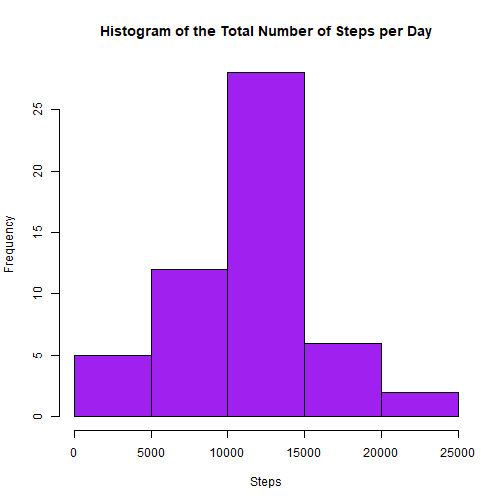
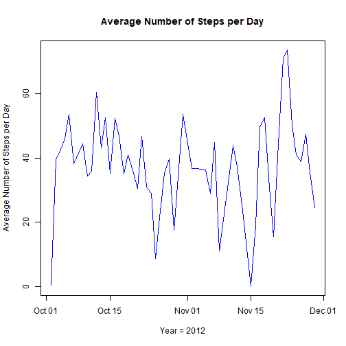
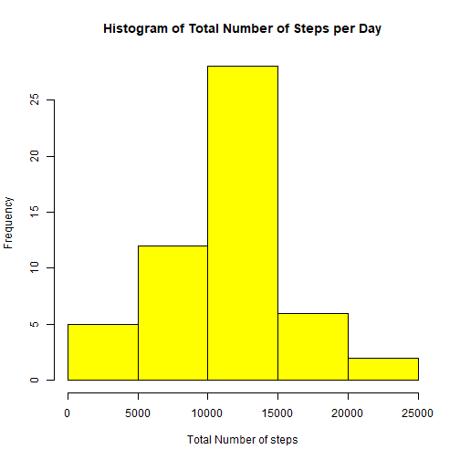
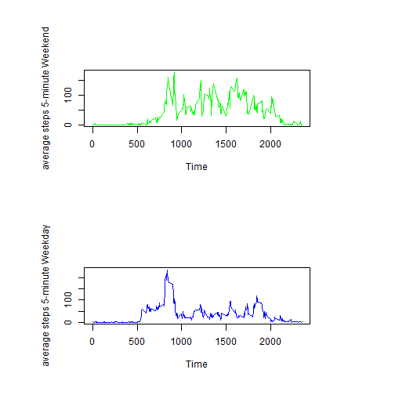

# Coursera Course: Reproducible Research
## Peer-Graded Project 1 in Reproducible Research
### Date started: November 12, 2018
### ------------------------------------------------
### ------------------------------------------------


```r
# Author: Nicholas Stewart
# Coursera course: Exploratory Data Analysis
# Date: November 12, 2018

# ------------------------------------------------------------------------------------------------------------------------------------------------------
# R code...
# ------------------------------------------------------------------------------------------------------------------------------------------------------
library(dplyr)

# section 1 read in data..

activity<-read.csv("C:\\Users\\nstewart\\Desktop\\Data Science Specialization\\Reproducible Research\\Project 1\\activity.csv",header=TRUE,as.is = TRUE)

# exclude NA's
a<-complete.cases(activity)

activity.clean<-activity[a,]   # data set with NA's removed...

ACTIVITY.CLEAN<-activity.clean

print("2,304 NA's across the original data set")
```

```
## [1] "2,304 NA's across the original data set"
```

```r
activity.clean$date<-as.Date(activity.clean$date,format="%Y-%m-%d")   # get date format

activity.clean$weekday<-weekdays(activity.clean$date)   # get day of the week for later use

activity.clean.gp<-group_by(activity.clean,date)    # group by day

activity.clean.summary<-summarize(activity.clean.gp,Total_steps=sum(steps),Average_steps=mean(steps),Median_steps=median(steps))   # aggregate to get total steps, average number of steps, and median number of steps

act<-activity.clean.summary   # shorten data frame name for convenience

# section 2
hist(act$Total_steps,xlab="Steps",ylab="Frequency",main="Histogram of the Total Number of Steps per Day", col="purple")
```



```r
# section 3
print("Average steps per day")
```

```
## [1] "Average steps per day"
```

```r
mean(act$Total_steps)
```

```
## [1] 10766.19
```

```r
# section 3
print("Median steps per day")
```

```
## [1] "Median steps per day"
```

```r
median(act$Total_steps)
```

```
## [1] 10765
```

```r
plot(act$date,act$Average_steps,xlab="Year = 2012",ylab="Average Number of Steps per Day",main="Average Number of Steps per Day",type="l",col="blue")
```



```r
activity.clean.gp2<-group_by(activity.clean,interval)

act2.summary<-summarize(activity.clean.gp2,Max_steps=max(steps))

which.max(act2.summary$Max_steps)
```

```
## [1] 76
```

```r
# section 5
print("Interval with maximum number of steps")
```

```
## [1] "Interval with maximum number of steps"
```

```r
act2.summary[76,]
```

```
## # A tibble: 1 x 2
##   interval Max_steps
##      <int>     <dbl>
## 1      615       806
```

```r
x<-seq(as.Date("2012-10-02"), as.Date("2012-11-29"), "days")

# section 6
for (k in x) {  # imputation: For missing "steps" use daily average for the imputation value
  activity$steps[is.na(activity$steps) & activity$date == k]<-act$Average_steps[act$date == k]   # fill in NA's with daily "steps" average
}

activity.gp<-group_by(activity,date)

activity.clean.summary2<-summarize(activity.clean.gp,Total_steps=sum(steps),Average_steps=mean(steps),Median_steps=median(steps))

act<-activity.clean.summary2  # imputed NA's data set

print("Average total steps imputed data")
```

```
## [1] "Average total steps imputed data"
```

```r
mean(act$Total_steps)
```

```
## [1] 10766.19
```

```r
print("Median total steps imputed data")
```

```
## [1] "Median total steps imputed data"
```

```r
median(act$Total_steps)
```

```
## [1] 10765
```

```r
# section 7
hist(activity.clean.summary2$Total_steps,xlab="Total Number of steps",ylab="Frequency",main="Histogram of Total Number of Steps per Day",col="yellow")
```



```r
# section 8
df<-ACTIVITY.CLEAN

df$date<-as.Date(as.character(df$date))

df$weekday<-weekdays(df$date)

df$dayOfWeek<-rep("A",length(df$date))
df$dayOfWeek[grep("Saturday|Sunday",df$weekday)]<-"weekend"
df$dayOfWeek[grep("[^(Saturday|Sunday)]",df$weekday)]<-"weekday"
df$dayOfWeek<-as.factor(df$dayOfWeek)

df2<-data.frame(steps=df$steps,interval=df$interval,dayOfWeek=df$dayOfWeek)

df2.gp<-group_by(df2,interval,dayOfWeek)

act2<-df2.gp

act2.summary<-summarize(act2,Average=mean(steps))

ACT<-act2.summary
par(mfrow = c(2,1), pin = c(4,1))
plot(ACT$interval[ACT$dayOfWeek == "weekend"],ACT$Average[ACT$dayOfWeek == "weekend"],xlab="Time",ylab="average steps 5-minute Weekend",type="l",col="green")
plot(ACT$interval[ACT$dayOfWeek == "weekday"],ACT$Average[ACT$dayOfWeek == "weekday"],xlab="Time",ylab="average steps 5-minute Weekday",type="l",col="blue")
```



```r
# -----------------------------------------------------------------------------------------------------------------------------------------------------
# End R code
# -----------------------------------------------------------------------------------------------------------------------------------------------------
```

